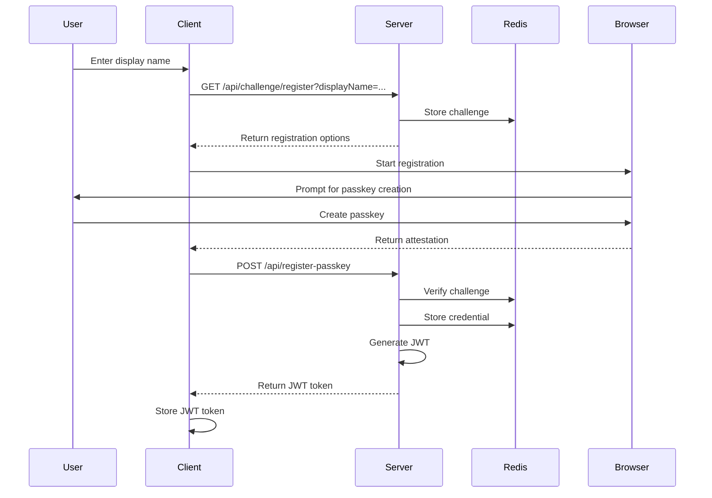
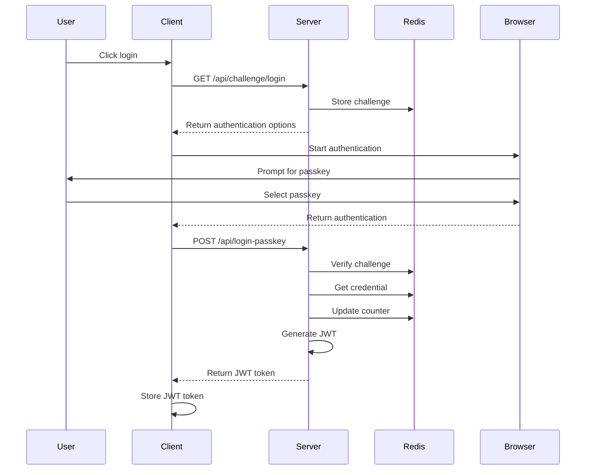
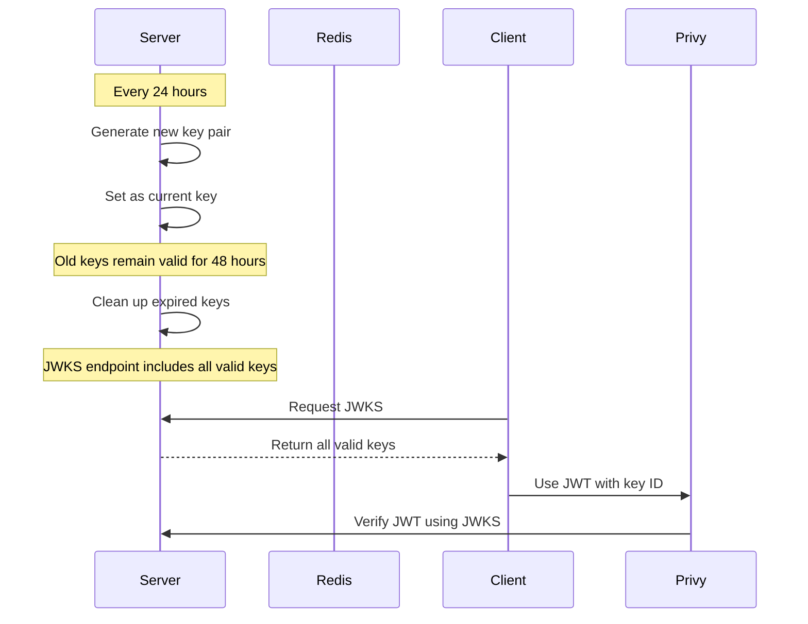
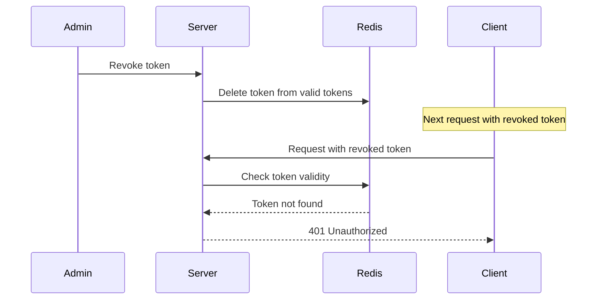
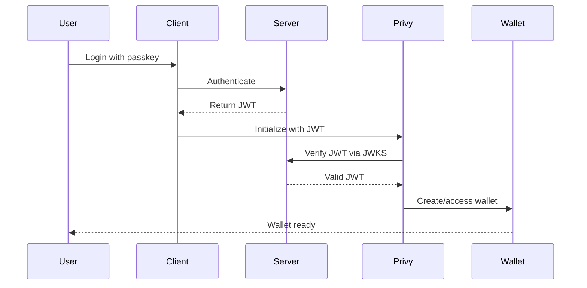
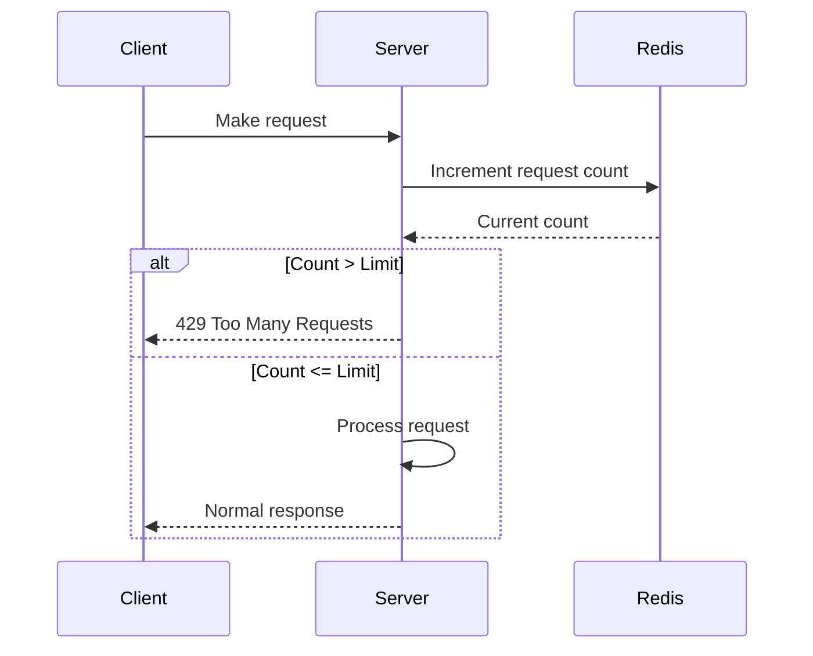
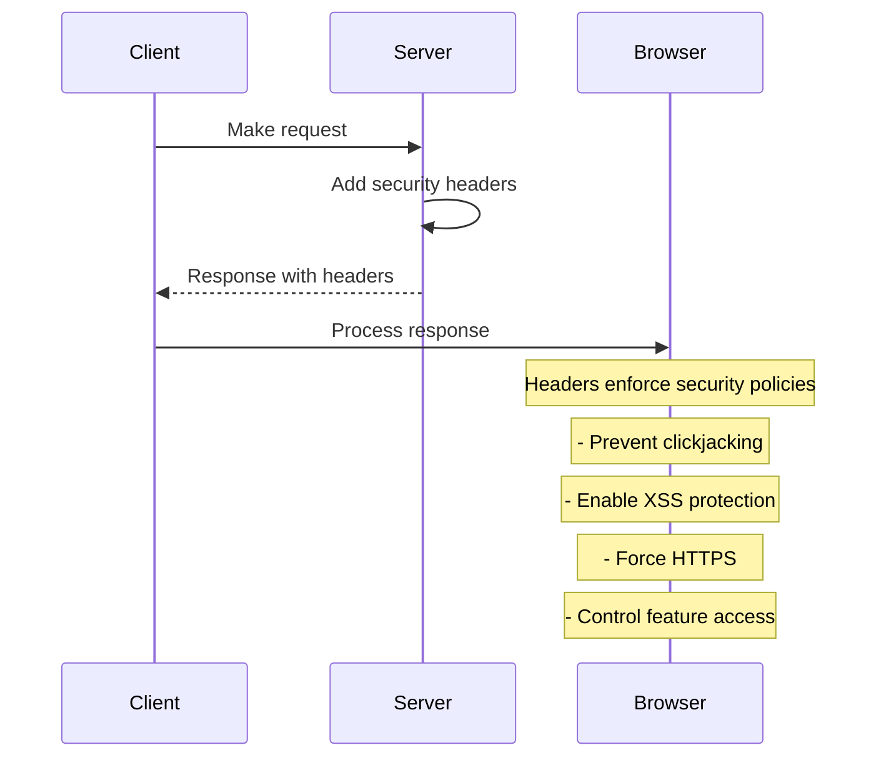
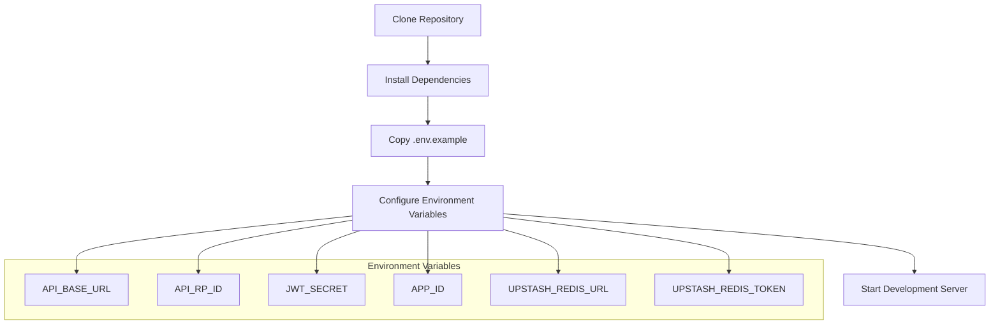
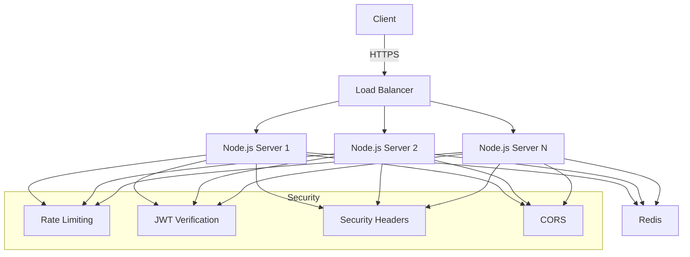

# Authentication Flow Diagrams

This document illustrates the authentication flows in the Passkey Authentication Backend, including both the passkey registration/login flow and the Privy integration flow.

## Passkey Registration Flow

## Passkey Login Flow

## JWT Key Rotation Flow

## Token Revocation Flow

## Privy Integration Flow

## Rate Limiting Flow

## Security Headers Flow

## Environment Setup

## Deployment Architecture

